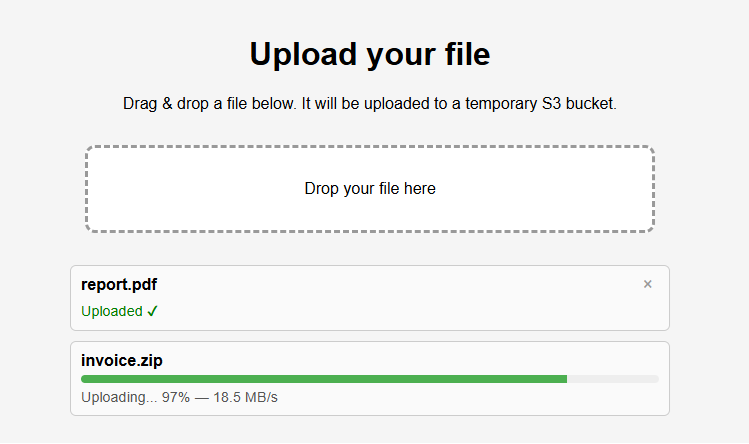
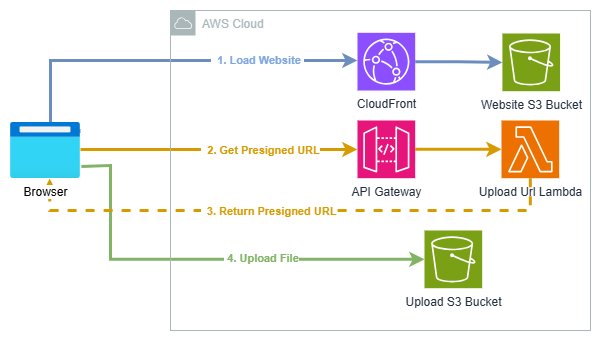

# S3EasyUpload
**By [DeployBlocks](https://www.deployblocks.com/)**

Deploy a lightweight file upload portal directly into your AWS account.

Files are uploaded straight from the browser using Amazon S3 presigned URLs, while AWS handles the file transfer.

## Why this project?

I wanted a simple way for users to upload files into an AWS account without requiring AWS access or a traditional backend server.

Instead of sending files through an application server, uploads go directly to Amazon S3 using presigned URLs generated by AWS Lambda.

## Highlights

- Deploy in under 5 minutes
- 100% Serverless
- Browser uploads directly to Amazon S3
- One CloudFormation template
- Easy to customize
- Automatic 24-hour file expiration

---

## Architecture

The architecture intentionally keeps things simple.

CloudFront serves the frontend, Lambda generates presigned URLs, and files are uploaded directly to Amazon S3.

### Upload Workflow

1. Load website through CloudFront.
2. Request a presigned upload URL.
3. Receive the presigned URL.
4. Upload the file directly to Amazon S3.

--- 

## Typical Use Cases

Designed for learning, experimentation, proof-of-concept deployments and temporary file collection workflows.

It provides a simple way to explore direct browser-to-S3 uploads and serverless AWS architectures.

---

## Features

### File Uploads

- Amazon S3 pre-signed upload URLs
- Drag & Drop uploads
- Multi-file uploads
- Upload progress
- Upload error handling
- Temporary file hosting
- Automatic file expiration
- HTTPS enabled by default
- Up to **1 GB per file**

> Upload files easily through a simple web interface without managing servers.

### Security

The upload workflow relies on AWS managed services and keeps permissions separated.

Users never receive AWS credentials, uploaded files are stored in private S3 buckets, and transfers happen over HTTPS through CloudFront.

Files are uploaded directly from the browser to Amazon S3 and never pass through the backend infrastructure.

As with any internet-facing service, review the architecture against your own security, compliance and operational requirements before production deployment.

Teams requiring authentication, stronger access controls, monitoring or abuse protection can extend the implementation according to their requirements.

### Infrastructure

The entire solution is deployed through a single CloudFormation template.

Amazon S3 stores uploaded files, CloudFront serves the frontend, API Gateway exposes the API and AWS Lambda generates presigned upload URLs.

Because the architecture is fully serverless, there are no servers, containers or databases to maintain.

---

## Extending the Solution

As upload workflows become more widely used, additional requirements often emerge, such as:

- Authentication
- Upload quotas
- Abuse protection
- Folder uploads with preserved directory structure
- Custom domain management
- Extended retention policies
- Monitoring and operational workflows

For teams that need these capabilities out of the box, S3EasyUpload Professional is available.

**[Explore S3EasyUpload Professional](https://deployblocks.gumroad.com/l/s3easyupload)**

---

## Quick Start

### Prerequisites

- An AWS account
- Permission to create CloudFormation stacks

An optional IAM template is included for environments where deployment permissions are managed separately and a least-privilege approach is preferred.

### Deployment

1. Download the CloudFormation template.
2. Open the AWS CloudFormation Console.
3. Create a new stack using `main.yaml`.
4. Configure the stack parameters.
5. Deploy the stack.
6. Open the generated CloudFront URL.
7. Start uploading files.
   
---

## AWS Costs

Because the application is fully serverless, there are no servers, containers or databases to manage.

You only pay for the AWS resources you use.

The main cost drivers are Amazon S3 storage, CloudFront data transfer, API Gateway requests and AWS Lambda invocations.

Costs can be estimated using the AWS Pricing Calculator.

---

## Configuration

The CloudFormation template provisions the complete infrastructure automatically, including Amazon S3, CloudFront, API Gateway and Lambda.

Only a small number of parameters are exposed, allowing most deployments to be launched with little or no customization.

| Parameter | Description |
|------------|------------|
| ProjectName | Prefix used for AWS resource names |
| Environment | Environment identifier |
| HTMLVersion | Optional version used to refresh the frontend deployment |

---

## FAQ

### Where are uploaded files stored?

Uploaded files are stored in an Amazon S3 bucket in your own AWS account.

### Are AWS credentials exposed to end users?

No. Files are uploaded using Amazon S3 pre-signed URLs. AWS credentials are never exposed to end users.

### How long are uploaded files kept?

Uploaded files are automatically deleted after **24 hours**.

### What is the maximum file size?

S3EasyUpload supports uploads of up to **1 GB per file**.

### Does S3EasyUpload require any servers?

No. The entire solution is fully serverless and uses Amazon S3, AWS Lambda, API Gateway and CloudFront.

### How can I get support?

Questions, feedback or bug reports regarding the Community Edition can be sent to:
community@s3easyupload.com

---

## License

This project is licensed under the **S3EasyUpload Community License**.

See the `LICENSE` file for complete licensing terms.

---

## About DeployBlocks

Practical infrastructure templates and tools for AWS and cloud development.

[Visit DeployBlocks](https://www.deployblocks.com/)